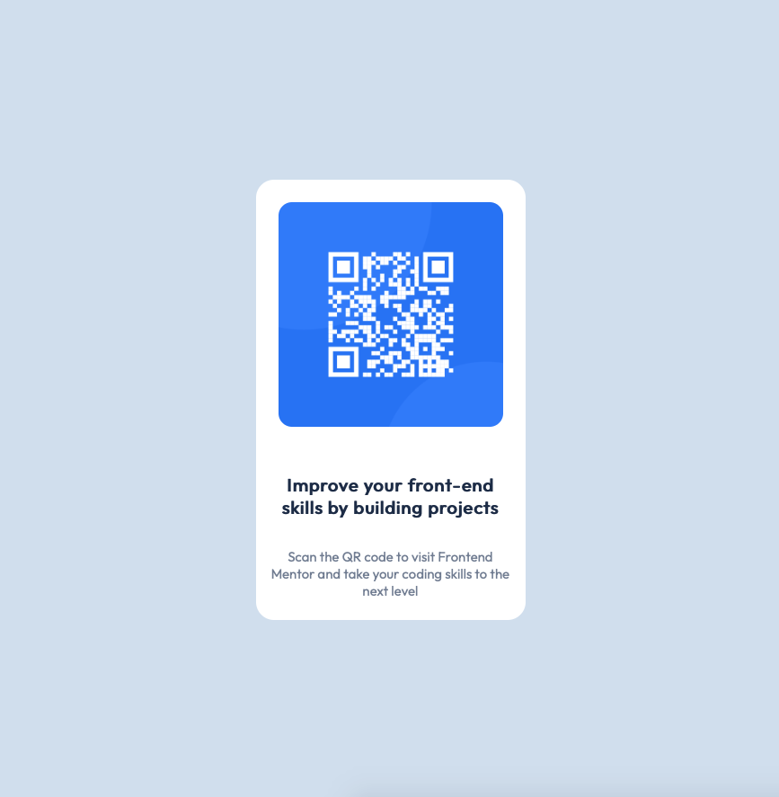

# Frontend Mentor - QR code component solution

This is a solution to the [QR code component challenge on Frontend Mentor](https://www.frontendmentor.io/challenges/qr-code-component-iux_sIO_H). Frontend Mentor challenges help you improve your coding skills by building realistic projects. 

## Built with

- HTML5
- CSS3

## Links

- Live Site URL: [Netlify](https://caroline-qr-code-component.netlify.app)

## Screenshot

